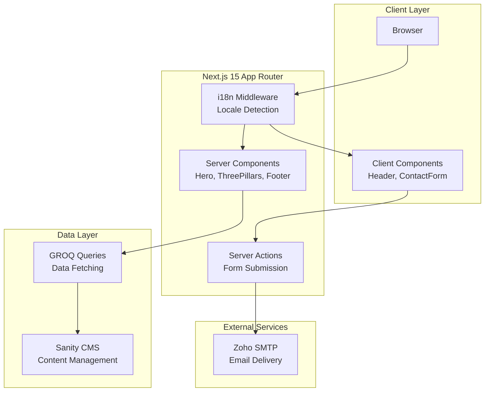

# Design Document: TYCHERA Website Migration

## Overview

This design document outlines the architecture and implementation strategy for migrating the TYCHERA Investments LTD website from a Vite/React prototype to a production-ready Next.js 15 application. The migration encompasses five major phases: architecture cleanup, routing and pages, CMS integration, internationalization, and production features.

### Current State Analysis

**Existing Prototype Structure:**
- Framework: Vite + React 18 + TypeScript
- Styling: Tailwind CSS v3
- UI Components: Shadcn/Radix UI (50+ primitives)
- Routing: React Router v6
- State Management: React Query, useState hooks
- Section Components: Header, Hero, ThreePillars, PrincipalVision, ContactSection, Footer, LocationMap
- Assets: SVG logos (color and white variants), hero image

**Target Architecture:**
- Framework: Next.js 15 (App Router)
- Rendering: React Server Components (RSC) by default
- Styling: Tailwind CSS v4
- CMS: Sanity
- i18n: next-intl
- Forms: React Hook Form + Zod
- Email: Zoho SMTP via Server Actions
- Testing: Vitest

## Architecture

### High-Level Architecture Diagram



### Directory Structure

The migration will transform the current Vite structure into a Next.js 15 App Router structure:

```
tychera-website/
├── app/                          # Next.js App Router
│   ├── [locale]/                 # i18n routing
│   │   ├── layout.tsx            # Root layout with providers
│   │   ├── page.tsx              # Home page
│   │   ├── expertise/
│   │   │   └── page.tsx          # Expertise detail page
│   │   └── not-found.tsx         # 404 page
│   ├── api/                      # API routes (if needed)
│   └── actions/                  # Server Actions
│       └── contact.ts            # Contact form submission
├── components/
│   ├── sections/                 # Large layout blocks (RSC)
│   │   ├── Header.tsx
│   │   ├── Hero.tsx
│   │   ├── ThreePillars.tsx
│   │   ├── PrincipalVision.tsx
│   │   ├── ContactSection.tsx
│   │   ├── Footer.tsx
│   │   └── LocationMap.tsx
│   └── ui/                       # Shadcn primitives
│       ├── button.tsx
│       ├── input.tsx
│       └── ... (50+ components)
├── lib/
│   ├── sanity/
│   │   ├── client.ts             # Sanity client config
│   │   ├── queries.ts            # GROQ queries
│   │   └── schemas/              # Content schemas
│   │       ├── teamMember.ts
│   │       ├── serviceItem.ts
│   │       └── pageContent.ts
│   ├── email/
│   │   └── zoho.ts               # SMTP configuration
│   └── utils.ts                  # Utility functions
├── messages/                     # i18n translations
│   ├── fr.json                   # French (primary)
│   └── en.json                   # English (secondary)
├── public/
│   ├── images/
│   │   ├── hero-infrastructure.jpg
│   │   ├── tychera-logo-color.svg
│   │   └── tychera-logo-white.svg
│   └── favicon.ico
├── sanity/                       # Sanity Studio
│   ├── schemas/
│   ├── sanity.config.ts
│   └── sanity.cli.ts
├── middleware.ts                 # next-intl middleware
├── i18n.ts                       # i18n configuration
├── next.config.js
├── tailwind.config.ts
└── tsconfig.json
```

### Component Classification

**Server Components (RSC - Default):**
- Hero: Static content, no interactivity
- ThreePillars: Intersection Observer can be replaced with CSS animations
- PrincipalVision: Static content
- Footer: Static content
- LocationMap: Static embedded map

**Client Components ('use client' directive):**
- Header: Language toggle, mobile menu state
- ContactSection: Form state, validation, submission
- UI primitives: Most Shadcn components (interactive by nature)

### Rendering Strategy

**Server-Side Rendering (SSR):**
- All pages will use SSR by default
- CMS content fetched on the server
- Metadata generated server-side for SEO

**Client-Side Interactivity:**
- Minimal JavaScript for forms and navigation
- Progressive enhancement approach
- Hydration only for interactive components

## Components and Interfaces

### Core Type Definitions

```typescript
// lib/types.ts

export interface ServicePillar {
  id: string;
  number: string;
  title: string;
  description: string;
  icon: string; // Icon name or Sanity image reference
  order: number;
  detailedContent?: string; // Rich text for expertise page
}

export interface TeamMember {
  id: string;
  name: string;
  role: string;
  bio: string;
  image: SanityImageAsset;
  order: number;
}

export interface PageContent {
  id: string;
  key: string; // Unique identifier (e.g., "hero-title", "about-text")
  content: string; // Rich text or plain text
  locale: 'fr' | 'en';
}

export interface ContactFormData {
  name: string;
  organization: string;
  email: string;
  phone?: string;
  country?: string;
  requestType: string;
  message: string;
}

export interface ContactFormResponse {
  success: boolean;
  message: string;
  error?: string;
}

export interface SanityImageAsset {
  _type: 'image';
  asset: {
    _ref: string;
    _type: 'reference';
  };
  alt?: string;
}

export type Locale = 'fr' | 'en';

export interface LocaleParams {
  locale: Locale;
}
```

### Sanity Schema Definitions

```typescript
// lib/sanity/schemas/serviceItem.ts

import { defineType, defineField } from 'sanity';

export const serviceItem = defineType({
  name: 'serviceItem',
  title: 'Service Item',
  type: 'document',
  fields: [
    defineField({
      name: 'number',
      title: 'Number',
      type: 'string',
      validation: Rule => Rule.required().regex(/^\d{2}$/, {
        name: 'two-digit',
        invert: false
      })
    }),
    defineField({
      name: 'title',
      title: 'Title',
      type: 'object',
      fields: [
        { name: 'fr', type: 'string', title: 'French' },
        { name: 'en', type: 'string', title: 'English' }
      ],
      validation: Rule => Rule.required()
    }),
    defineField({
      name: 'description',
      title: 'Description',
      type: 'object',
      fields: [
        { name: 'fr', type: 'text', title: 'French' },
        { name: 'en', type: 'text', title: 'English' }
      ],
      validation: Rule => Rule.required()
    }),
    defineField({
      name: 'detailedContent',
      title: 'Detailed Content',
      type: 'object',
      fields: [
        { name: 'fr', type: 'array', of: [{ type: 'block' }], title: 'French' },
        { name: 'en', type: 'array', of: [{ type: 'block' }], title: 'English' }
      ]
    }),
    defineField({
      name: 'icon',
      title: 'Icon Name',
      type: 'string',
      description: 'Lucide icon name (e.g., "Scale", "Construction")',
      validation: Rule => Rule.required()
    }),
    defineField({
      name: 'order',
      title: 'Display Order',
      type: 'number',
      validation: Rule => Rule.required().min(1).max(4)
    })
  ],
  preview: {
    select: {
      title: 'title.fr',
      subtitle: 'number',
      order: 'order'
    },
    prepare({ title, subtitle, order }) {
      return {
        title: `${subtitle}. ${title}`,
        subtitle: `Order: ${order}`
      };
    }
  }
});
```

```typescript
// lib/sanity/schemas/teamMember.ts

import { defineType, defineField } from 'sanity';

export const teamMember = defineType({
  name: 'teamMember',
  title: 'Team Member',
  type: 'document',
  fields: [
    defineField({
      name: 'name',
      title: 'Full Name',
      type: 'string',
      validation: Rule => Rule.required()
    }),
    defineField({
      name: 'role',
      title: 'Role/Title',
      type: 'object',
      fields: [
        { name: 'fr', type: 'string', title: 'French' },
        { name: 'en', type: 'string', title: 'English' }
      ],
      validation: Rule => Rule.required()
    }),
    defineField({
      name: 'bio',
      title: 'Biography',
      type: 'object',
      fields: [
        { name: 'fr', type: 'array', of: [{ type: 'block' }], title: 'French' },
        { name: 'en', type: 'array', of: [{ type: 'block' }], title: 'English' }
      ],
      validation: Rule => Rule.required()
    }),
    defineField({
      name: 'image',
      title: 'Profile Image',
      type: 'image',
      options: {
        hotspot: true
      },
      validation: Rule => Rule.required()
    }),
    defineField({
      name: 'order',
      title: 'Display Order',
      type: 'number',
      validation: Rule => Rule.required().min(1)
    })
  ],
  preview: {
    select: {
      title: 'name',
      subtitle: 'role.fr',
      media: 'image'
    }
  }
});
```

```typescript
// lib/sanity/schemas/pageContent.ts

import { defineType, defineField } from 'sanity';

export const pageContent = defineType({
  name: 'pageContent',
  title: 'Page Content',
  type: 'document',
  fields: [
    defineField({
      name: 'key',
      title: 'Content Key',
      type: 'string',
      description: 'Unique identifier (e.g., "hero-title", "about-section")',
      validation: Rule => Rule.required().regex(/^[a-z0-9-]+$/, {
        name: 'kebab-case',
        invert: false
      })
    }),
    defineField({
      name: 'content',
      title: 'Content',
      type: 'object',
      fields: [
        { 
          name: 'fr', 
          type: 'array', 
          of: [{ type: 'block' }], 
          title: 'French (Primary)' 
        },
        { 
          name: 'en', 
          type: 'array', 
          of: [{ type: 'block' }], 
          title: 'English' 
        }
      ],
      validation: Rule => Rule.required()
    }),
    defineField({
      name: 'page',
      title: 'Page',
      type: 'string',
      options: {
        list: [
          { title: 'Home', value: 'home' },
          { title: 'Expertise', value: 'expertise' },
          { title: 'About', value: 'about' }
        ]
      },
      validation: Rule => Rule.required()
    })
  ],
  preview: {
    select: {
      title: 'key',
      subtitle: 'page'
    }
  }
});
```

### GROQ Queries

```typescript
// lib/sanity/queries.ts

import { groq } from 'next-sanity';

export const SERVICE_ITEMS_QUERY = groq`
  *[_type == "serviceItem"] | order(order asc) {
    _id,
    number,
    title,
    description,
    detailedContent,
    icon,
    order
  }
`;

export const TEAM_MEMBERS_QUERY = groq`
  *[_type == "teamMember"] | order(order asc) {
    _id,
    name,
    role,
    bio,
    image,
    order
  }
`;

export const PAGE_CONTENT_QUERY = groq`
  *[_type == "pageContent" && page == $page] {
    _id,
    key,
    content,
    page
  }
`;

export const SINGLE_SERVICE_QUERY = groq`
  *[_type == "serviceItem" && _id == $id][0] {
    _id,
    number,
    title,
    description,
    detailedContent,
    icon,
    order
  }
`;
```

### Sanity Client Configuration

```typescript
// lib/sanity/client.ts

import { createClient } from 'next-sanity';

export const client = createClient({
  projectId: process.env.NEXT_PUBLIC_SANITY_PROJECT_ID!,
  dataset: process.env.NEXT_PUBLIC_SANITY_DATASET || 'production',
  apiVersion: '2024-01-01',
  useCdn: process.env.NODE_ENV === 'production',
  token: process.env.SANITY_API_TOKEN,
});

export async function sanityFetch<T>({
  query,
  params = {},
  tags = [],
}: {
  query: string;
  params?: Record<string, any>;
  tags?: string[];
}): Promise<T> {
  return client.fetch<T>(query, params, {
    next: {
      revalidate: process.env.NODE_ENV === 'development' ? 0 : 3600,
      tags,
    },
  });
}
```

### i18n Configuration

```typescript
// i18n.ts

import { notFound } from 'next/navigation';
import { getRequestConfig } from 'next-intl/server';

export const locales = ['fr', 'en'] as const;
export const defaultLocale = 'fr' as const;

export type Locale = (typeof locales)[number];

export default getRequestConfig(async ({ locale }) => {
  if (!locales.includes(locale as Locale)) notFound();

  return {
    messages: (await import(`./messages/${locale}.json`)).default,
  };
});
```

```typescript
// middleware.ts

import createMiddleware from 'next-intl/middleware';
import { locales, defaultLocale } from './i18n';

export default createMiddleware({
  locales,
  defaultLocale,
  localePrefix: 'as-needed', // Don't prefix default locale
});

export const config = {
  matcher: ['/', '/(fr|en)/:path*', '/((?!api|_next|_vercel|.*\\..*).*)'],
};
```

### Server Actions

```typescript
// app/actions/contact.ts

'use server';

import { z } from 'zod';
import nodemailer from 'nodemailer';
import type { ContactFormData, ContactFormResponse } from '@/lib/types';

const contactFormSchema = z.object({
  name: z.string().min(2, 'Name must be at least 2 characters'),
  organization: z.string().min(2, 'Organization is required'),
  email: z.string().email('Invalid email address'),
  phone: z.string().optional(),
  country: z.string().optional(),
  requestType: z.string().min(1, 'Please select a request type'),
  message: z.string().min(10, 'Message must be at least 10 characters'),
});

export async function submitContactForm(
  data: ContactFormData
): Promise<ContactFormResponse> {
  try {
    // Validate form data
    const validatedData = contactFormSchema.parse(data);

    // Configure Zoho SMTP transporter
    const transporter = nodemailer.createTransporter({
      host: process.env.ZOHO_SMTP_HOST || 'smtp.zoho.com',
      port: parseInt(process.env.ZOHO_SMTP_PORT || '465'),
      secure: true,
      auth: {
        user: process.env.ZOHO_SMTP_USER!,
        pass: process.env.ZOHO_SMTP_PASSWORD!,
      },
    });

    // Compose email
    const mailOptions = {
      from: process.env.ZOHO_SMTP_USER!,
      to: process.env.CONTACT_EMAIL_RECIPIENT!,
      subject: `Nouvelle demande: ${validatedData.requestType} - ${validatedData.organization}`,
      html: `
        <h2>Nouvelle demande de contact</h2>
        <p><strong>Nom:</strong> ${validatedData.name}</p>
        <p><strong>Organisation:</strong> ${validatedData.organization}</p>
        <p><strong>Email:</strong> ${validatedData.email}</p>
        ${validatedData.phone ? `<p><strong>Téléphone:</strong> ${validatedData.phone}</p>` : ''}
        ${validatedData.country ? `<p><strong>Pays:</strong> ${validatedData.country}</p>` : ''}
        <p><strong>Type de demande:</strong> ${validatedData.requestType}</p>
        <p><strong>Message:</strong></p>
        <p>${validatedData.message.replace(/\n/g, '<br>')}</p>
      `,
    };

    // Send email
    await transporter.sendMail(mailOptions);

    return {
      success: true,
      message: 'Votre message a été envoyé avec succès.',
    };
  } catch (error) {
    console.error('Contact form submission error:', error);

    if (error instanceof z.ZodError) {
      return {
        success: false,
        message: 'Données du formulaire invalides.',
        error: error.errors[0].message,
      };
    }

    return {
      success: false,
      message: 'Une erreur est survenue lors de l\'envoi du message.',
      error: 'Internal server error',
    };
  }
}
```

## Data Models

### Translation Message Structure

```json
// messages/fr.json (excerpt)
{
  "nav": {
    "expertise": "Expertise",
    "institution": "L'Institution",
    "contact": "Contact"
  },
  "hero": {
    "title": "Architecte du Financement des Projets en Afrique",
    "subtitle": "Le pont entre capital international et potentiel africain. Structuration sophistiquée, impact durable.",
    "cta": "Découvrir nos services"
  },
  "pillars": {
    "sectionTitle": "Nos Piliers d'Excellence",
    "sectionSubtitle": "Excellence financière au service du développement durable"
  },
  "contact": {
    "title": "Initier une Collaboration Stratégique",
    "form": {
      "name": "Nom complet",
      "organization": "Organisation / Entreprise",
      "email": "Email professionnel",
      "phone": "Téléphone (avec indicatif pays)",
      "country": "Pays",
      "requestType": "Type de demande",
      "message": "Message / Description du Projet",
      "submit": "Envoyer ma demande",
      "success": "Merci pour votre message",
      "error": "Une erreur est survenue"
    }
  },
  "footer": {
    "address": "Immeuble OHANA, Nyarutarama, Kigali, Rwanda",
    "tin": "TIN: 123456789",
    "copyright": "© 2024 TYCHERA INVESTMENTS LTD. Tous droits réservés."
  }
}
```

```json
// messages/en.json (excerpt)
{
  "nav": {
    "expertise": "Expertise",
    "institution": "The Institution",
    "contact": "Contact"
  },
  "hero": {
    "title": "Architect of Project Financing in Africa",
    "subtitle": "The bridge between international capital and African potential. Sophisticated structuring, sustainable impact.",
    "cta": "Discover our services"
  },
  "pillars": {
    "sectionTitle": "Our Pillars of Excellence",
    "sectionSubtitle": "Financial excellence in service of sustainable development"
  },
  "contact": {
    "title": "Initiate a Strategic Collaboration",
    "form": {
      "name": "Full name",
      "organization": "Organization / Company",
      "email": "Professional email",
      "phone": "Phone (with country code)",
      "country": "Country",
      "requestType": "Request type",
      "message": "Message / Project Description",
      "submit": "Send my request",
      "success": "Thank you for your message",
      "error": "An error occurred"
    }
  },
  "footer": {
    "address": "OHANA Building, Nyarutarama, Kigali, Rwanda",
    "tin": "TIN: 123456789",
    "copyright": "© 2024 TYCHERA INVESTMENTS LTD. All rights reserved."
  }
}
```

### Environment Variables

```bash
# .env.example

# Next.js
NEXT_PUBLIC_SITE_URL=https://tycherainvestments.com

# Sanity CMS
NEXT_PUBLIC_SANITY_PROJECT_ID=your_project_id
NEXT_PUBLIC_SANITY_DATASET=production
SANITY_API_TOKEN=your_api_token

# Zoho SMTP
ZOHO_SMTP_HOST=smtp.zoho.com
ZOHO_SMTP_PORT=465
ZOHO_SMTP_USER=contact@tycherainvestments.com
ZOHO_SMTP_PASSWORD=your_smtp_password

# Contact Form
CONTACT_EMAIL_RECIPIENT=contact@tycherainvestments.com

# i18n
NEXT_PUBLIC_DEFAULT_LOCALE=fr
```

## Correctness Properties


*A property is a characteristic or behavior that should hold true across all valid executions of a system—essentially, a formal statement about what the system should do. Properties serve as the bridge between human-readable specifications and machine-verifiable correctness guarantees.*

### Property Reflection

After analyzing all acceptance criteria, I've identified the following testable properties. Before listing them, let me perform a reflection to eliminate redundancy:

**Redundancy Analysis:**
- Properties 2.5 and 12.2 both test ARIA labels on interactive elements → Combine into one comprehensive property
- Properties 6.1, 6.2, 6.3 test design system colors → Can be combined into one property about design system compliance
- Properties 6.4 and 6.5 test typography → Can be combined into one property about font usage
- Properties 10.2, 10.3, 10.4 test forbidden language → Can be combined into one property about content compliance
- Properties 7.4, 7.6, 7.7 all test form validation → Can be combined into one comprehensive validation property

**Final Property Set (after removing redundancy):**

### Property 1: Accessibility - Interactive Elements

*For any* interactive element (button, link, form input, toggle), that element should have either an ARIA label, accessible name, or semantic HTML that provides context for assistive technologies.

**Validates: Requirements 2.5, 12.2**

### Property 2: Accessibility - Semantic HTML Structure

*For any* page in the application, the page should use semantic HTML elements (header, nav, main, section, article, footer) appropriately for content structure.

**Validates: Requirements 12.1**

### Property 3: Accessibility - Heading Hierarchy

*For any* page in the application, heading levels (h1, h2, h3, h4, h5, h6) should not skip levels (e.g., h1 → h3 without h2 in between).

**Validates: Requirements 12.3**

### Property 4: Accessibility - Color Contrast

*For any* text/background color combination used in the application, the contrast ratio should meet WCAG AA standards (4.5:1 for normal text, 3:1 for large text).

**Validates: Requirements 12.4**

### Property 5: Accessibility - Keyboard Navigation

*For any* interactive element, that element should be reachable and operable using only keyboard navigation (Tab, Enter, Space, Arrow keys).

**Validates: Requirements 12.5**

### Property 6: Accessibility - Image Alt Text

*For any* image element in the application, the image should have an alt attribute (empty string for decorative images, descriptive text for content images).

**Validates: Requirements 12.6**

### Property 7: Accessibility - Form Labels

*For any* form input element, that input should have an associated label element or aria-label attribute.

**Validates: Requirements 12.7**

### Property 8: SEO - Page Metadata

*For any* page route in the application, that page should have complete metadata including title, description, and canonical URL.

**Validates: Requirements 3.5**

### Property 9: SEO - Open Graph Tags

*For any* page route in the application, that page should have Open Graph tags including og:title, og:description, og:image, and og:url.

**Validates: Requirements 3.6**

### Property 10: CMS Error Handling

*For any* CMS query that fails (network error, invalid query, missing content), the system should handle the error gracefully without crashing and provide appropriate fallback content or error messages.

**Validates: Requirements 4.6**

### Property 11: i18n - Language Persistence

*For any* language selection (French or English), after navigating to a different page, the selected language should remain active.

**Validates: Requirements 5.9**

### Property 12: Design System - Color Compliance

*For any* primary button, that button should use Primary Blue (#2283a2); for any sustainability indicator, it should use Accent Green (#588157); for any border or divider, it should use Gold (#E9C46A).

**Validates: Requirements 6.1, 6.2, 6.3**

### Property 13: Design System - Typography

*For any* heading element (h1-h6), that element should use Playfair Display font; for any body text element (p, span, div with text), it should use Inter font.

**Validates: Requirements 6.4, 6.5**

### Property 14: Design System - Responsive Layout

*For any* viewport width (mobile: 320-767px, tablet: 768-1023px, desktop: 1024px+), the layout should adapt appropriately without horizontal scrolling or content overflow.

**Validates: Requirements 6.7**

### Property 15: Form Validation - Comprehensive

*For any* form submission with invalid data (missing required fields, invalid email format, empty strings), the system should prevent submission and display field-specific error messages.

**Validates: Requirements 7.4, 7.6, 7.7**

### Property 16: Form Submission - Success Path

*For any* valid form submission, the system should process the data via Server Action and return a success response.

**Validates: Requirements 7.5**

### Property 17: Email Delivery - Content Completeness

*For any* contact form submission that triggers an email, the email body should contain all submitted form fields (name, organization, email, phone, country, requestType, message).

**Validates: Requirements 8.2, 8.3**

### Property 18: Email Delivery - Error Handling

*For any* SMTP error during email sending (connection timeout, authentication failure, rate limit), the system should handle the error gracefully and return an appropriate error message to the user.

**Validates: Requirements 8.5**

### Property 19: Content Compliance - Forbidden Language

*For any* text content in the application (excluding code and technical documentation), the content should not contain forbidden terms: "rocketship", "unleash", "disrupt", "game-changer", "awesome", "cool", "amazing", "limited time", "act now", "don't miss out".

**Validates: Requirements 10.2, 10.3, 10.4**

### Property 20: Expertise Page - Service Pillar Icons

*For any* service pillar displayed on the expertise page, that pillar should have an associated icon.

**Validates: Requirements 15.3**

## Error Handling

### Error Handling Strategy

The application will implement a comprehensive error handling strategy across all layers:

**1. CMS Data Fetching Errors**

```typescript
// lib/sanity/client.ts

export async function sanityFetch<T>({
  query,
  params = {},
  tags = [],
}: {
  query: string;
  params?: Record<string, any>;
  tags?: string[];
}): Promise<T> {
  try {
    return await client.fetch<T>(query, params, {
      next: {
        revalidate: process.env.NODE_ENV === 'development' ? 0 : 3600,
        tags,
      },
    });
  } catch (error) {
    console.error('Sanity fetch error:', error);
    
    // Return fallback data or throw with context
    throw new Error(`Failed to fetch data: ${error instanceof Error ? error.message : 'Unknown error'}`);
  }
}
```

**Error Boundaries for CMS Content:**

```typescript
// components/sections/ErrorBoundary.tsx

'use client';

import { useEffect } from 'react';

export function CMSErrorBoundary({
  error,
  reset,
}: {
  error: Error & { digest?: string };
  reset: () => void;
}) {
  useEffect(() => {
    console.error('CMS Error:', error);
  }, [error]);

  return (
    <div className="min-h-[400px] flex items-center justify-center">
      <div className="text-center max-w-md px-6">
        <h2 className="text-2xl font-serif text-foreground mb-4">
          Contenu temporairement indisponible
        </h2>
        <p className="text-muted-foreground font-sans mb-6">
          Nous rencontrons des difficultés à charger ce contenu. 
          Veuillez réessayer dans quelques instants.
        </p>
        <button
          onClick={reset}
          className="px-6 py-3 bg-primary text-primary-foreground rounded-sm hover:bg-primary/90 transition-colors"
        >
          Réessayer
        </button>
      </div>
    </div>
  );
}
```

**2. Form Submission Errors**

```typescript
// app/actions/contact.ts

export async function submitContactForm(
  data: ContactFormData
): Promise<ContactFormResponse> {
  try {
    // Validation
    const validatedData = contactFormSchema.parse(data);

    // SMTP sending
    await transporter.sendMail(mailOptions);

    return {
      success: true,
      message: 'Votre message a été envoyé avec succès.',
    };
  } catch (error) {
    // Zod validation errors
    if (error instanceof z.ZodError) {
      return {
        success: false,
        message: 'Données du formulaire invalides.',
        error: error.errors[0].message,
      };
    }

    // SMTP errors
    if (error instanceof Error && error.message.includes('SMTP')) {
      return {
        success: false,
        message: 'Erreur lors de l\'envoi de l\'email. Veuillez réessayer.',
        error: 'SMTP connection failed',
      };
    }

    // Generic errors
    console.error('Contact form submission error:', error);
    return {
      success: false,
      message: 'Une erreur est survenue. Veuillez réessayer plus tard.',
      error: 'Internal server error',
    };
  }
}
```

**3. i18n Missing Translation Errors**

```typescript
// i18n.ts

export default getRequestConfig(async ({ locale }) => {
  if (!locales.includes(locale as Locale)) {
    notFound();
  }

  try {
    const messages = (await import(`./messages/${locale}.json`)).default;
    return { messages };
  } catch (error) {
    console.error(`Failed to load messages for locale: ${locale}`, error);
    
    // Fallback to French (default locale)
    const fallbackMessages = (await import(`./messages/fr.json`)).default;
    return { messages: fallbackMessages };
  }
});
```

**4. Image Loading Errors**

```typescript
// components/ui/SafeImage.tsx

'use client';

import Image from 'next/image';
import { useState } from 'react';

export function SafeImage({
  src,
  alt,
  fallbackSrc = '/images/placeholder.svg',
  ...props
}: ImageProps & { fallbackSrc?: string }) {
  const [imgSrc, setImgSrc] = useState(src);

  return (
    <Image
      {...props}
      src={imgSrc}
      alt={alt}
      onError={() => {
        setImgSrc(fallbackSrc);
      }}
    />
  );
}
```

**5. Environment Variable Validation**

```typescript
// lib/env.ts

import { z } from 'zod';

const envSchema = z.object({
  NEXT_PUBLIC_SANITY_PROJECT_ID: z.string().min(1),
  NEXT_PUBLIC_SANITY_DATASET: z.string().min(1),
  SANITY_API_TOKEN: z.string().min(1),
  ZOHO_SMTP_HOST: z.string().min(1),
  ZOHO_SMTP_PORT: z.string().min(1),
  ZOHO_SMTP_USER: z.string().email(),
  ZOHO_SMTP_PASSWORD: z.string().min(1),
  CONTACT_EMAIL_RECIPIENT: z.string().email(),
});

export function validateEnv() {
  try {
    envSchema.parse(process.env);
  } catch (error) {
    if (error instanceof z.ZodError) {
      console.error('❌ Invalid environment variables:');
      error.errors.forEach((err) => {
        console.error(`  - ${err.path.join('.')}: ${err.message}`);
      });
      process.exit(1);
    }
  }
}
```

### Error Logging Strategy

**Development:**
- Console logging with detailed error information
- Stack traces visible in browser console
- Sanity Studio errors displayed in UI

**Production:**
- Structured error logging to external service (e.g., Sentry, LogRocket)
- User-friendly error messages (no stack traces)
- Error tracking with context (user action, route, timestamp)

```typescript
// lib/logger.ts

export function logError(
  error: Error,
  context: {
    action: string;
    route: string;
    userId?: string;
  }
) {
  if (process.env.NODE_ENV === 'production') {
    // Send to external logging service
    // Sentry.captureException(error, { contexts: { custom: context } });
  } else {
    console.error('Error:', error);
    console.error('Context:', context);
  }
}
```

## Testing Strategy

### Dual Testing Approach

The TYCHERA website migration will employ both unit testing and property-based testing to ensure comprehensive coverage:

**Unit Tests:**
- Specific examples and edge cases
- Integration points between components
- Error conditions and boundary cases
- Focus on concrete scenarios

**Property Tests:**
- Universal properties across all inputs
- Comprehensive input coverage through randomization
- Validation of design system compliance
- Accessibility compliance verification

### Property-Based Testing Configuration

**Library Selection:** We will use **fast-check** for property-based testing in TypeScript/JavaScript.

**Configuration:**
- Minimum 100 iterations per property test
- Each property test references its design document property
- Tag format: `Feature: tychera-website-migration, Property {number}: {property_text}`

**Example Property Test Structure:**

```typescript
// __tests__/properties/accessibility.test.ts

import { test, expect } from 'vitest';
import fc from 'fast-check';
import { render } from '@testing-library/react';

/**
 * Feature: tychera-website-migration
 * Property 1: Accessibility - Interactive Elements
 * 
 * For any interactive element, that element should have either an ARIA label,
 * accessible name, or semantic HTML that provides context.
 */
test('Property 1: Interactive elements have accessible names', () => {
  fc.assert(
    fc.property(
      fc.record({
        type: fc.constantFrom('button', 'link', 'input'),
        text: fc.string({ minLength: 1, maxLength: 50 }),
        ariaLabel: fc.option(fc.string({ minLength: 1 }), { nil: undefined }),
      }),
      (elementConfig) => {
        const { type, text, ariaLabel } = elementConfig;
        
        // Render element based on type
        const { container } = render(
          type === 'button' ? (
            <button aria-label={ariaLabel}>{text}</button>
          ) : type === 'link' ? (
            <a href="#" aria-label={ariaLabel}>{text}</a>
          ) : (
            <input type="text" aria-label={ariaLabel || text} />
          )
        );

        // Verify accessible name exists
        const element = container.firstChild as HTMLElement;
        const accessibleName = 
          element.getAttribute('aria-label') || 
          element.textContent ||
          element.getAttribute('placeholder');

        expect(accessibleName).toBeTruthy();
        expect(accessibleName!.length).toBeGreaterThan(0);
      }
    ),
    { numRuns: 100 }
  );
});

/**
 * Feature: tychera-website-migration
 * Property 12: Design System - Color Compliance
 */
test('Property 12: Primary buttons use correct color', () => {
  fc.assert(
    fc.property(
      fc.record({
        text: fc.string({ minLength: 1, maxLength: 30 }),
        variant: fc.constantFrom('primary', 'secondary', 'outline'),
      }),
      (buttonConfig) => {
        const { text, variant } = buttonConfig;
        
        const { container } = render(
          <button className={variant === 'primary' ? 'bg-primary' : ''}>
            {text}
          </button>
        );

        const button = container.firstChild as HTMLElement;
        
        if (variant === 'primary') {
          const styles = window.getComputedStyle(button);
          const bgColor = styles.backgroundColor;
          
          // Convert #2283a2 to rgb(34, 131, 162)
          expect(bgColor).toBe('rgb(34, 131, 162)');
        }
      }
    ),
    { numRuns: 100 }
  );
});
```

### Unit Testing Strategy

**Test Organization:**
```
__tests__/
├── unit/
│   ├── components/
│   │   ├── Header.test.tsx
│   │   ├── ContactSection.test.tsx
│   │   └── Footer.test.tsx
│   ├── lib/
│   │   ├── sanity/
│   │   │   └── client.test.ts
│   │   └── email/
│   │       └── zoho.test.ts
│   └── actions/
│       └── contact.test.ts
├── properties/
│   ├── accessibility.test.ts
│   ├── design-system.test.ts
│   ├── forms.test.ts
│   └── content.test.ts
└── integration/
    ├── form-submission.test.ts
    └── cms-integration.test.ts
```

**Unit Test Examples:**

```typescript
// __tests__/unit/components/Header.test.tsx

import { test, expect } from 'vitest';
import { render, screen } from '@testing-library/react';
import userEvent from '@testing-library/user-event';
import Header from '@/components/sections/Header';

test('Header displays language toggle', () => {
  render(<Header />);
  
  expect(screen.getByText('FR')).toBeInTheDocument();
  expect(screen.getByText('EN')).toBeInTheDocument();
});

test('Language toggle switches active language', async () => {
  const user = userEvent.setup();
  render(<Header />);
  
  const enButton = screen.getByText('EN');
  await user.click(enButton);
  
  // Verify EN is now active (implementation-specific assertion)
  expect(enButton).toHaveClass('text-primary');
});

test('Mobile menu opens on hamburger click', async () => {
  const user = userEvent.setup();
  render(<Header />);
  
  const menuButton = screen.getByRole('button', { name: /menu/i });
  await user.click(menuButton);
  
  // Verify mobile menu is visible
  expect(screen.getByRole('dialog')).toBeInTheDocument();
});
```

```typescript
// __tests__/unit/actions/contact.test.ts

import { test, expect, vi } from 'vitest';
import { submitContactForm } from '@/app/actions/contact';

test('Valid form submission returns success', async () => {
  const validData = {
    name: 'Jean Dupont',
    organization: 'Entreprise SA',
    email: 'jean@entreprise.com',
    phone: '+250 793 145 440',
    country: 'Rwanda',
    requestType: 'financement',
    message: 'Je souhaite discuter d\'un projet d\'infrastructure.',
  };

  const result = await submitContactForm(validData);
  
  expect(result.success).toBe(true);
  expect(result.message).toContain('succès');
});

test('Invalid email returns validation error', async () => {
  const invalidData = {
    name: 'Jean Dupont',
    organization: 'Entreprise SA',
    email: 'invalid-email',
    requestType: 'financement',
    message: 'Test message',
  };

  const result = await submitContactForm(invalidData);
  
  expect(result.success).toBe(false);
  expect(result.error).toContain('email');
});

test('Missing required fields returns validation error', async () => {
  const incompleteData = {
    name: 'Jean Dupont',
    email: 'jean@entreprise.com',
    // Missing organization, requestType, message
  };

  const result = await submitContactForm(incompleteData as any);
  
  expect(result.success).toBe(false);
});
```

### Integration Testing

```typescript
// __tests__/integration/form-submission.test.ts

import { test, expect } from 'vitest';
import { render, screen } from '@testing-library/react';
import userEvent from '@testing-library/user-event';
import ContactSection from '@/components/sections/ContactSection';

test('Complete form submission flow', async () => {
  const user = userEvent.setup();
  render(<ContactSection />);
  
  // Fill out form
  await user.type(screen.getByLabelText(/nom/i), 'Jean Dupont');
  await user.type(screen.getByLabelText(/organisation/i), 'Entreprise SA');
  await user.type(screen.getByLabelText(/email/i), 'jean@entreprise.com');
  await user.selectOptions(screen.getByLabelText(/type de demande/i), 'financement');
  await user.type(screen.getByLabelText(/message/i), 'Je souhaite discuter d\'un projet.');
  
  // Submit form
  await user.click(screen.getByRole('button', { name: /envoyer/i }));
  
  // Verify success message appears
  expect(await screen.findByText(/merci/i)).toBeInTheDocument();
});
```

### Test Coverage Goals

- **Critical Paths:** 90%+ coverage
  - Form validation and submission
  - CMS data fetching
  - i18n translation loading
  - Server Actions

- **UI Components:** 80%+ coverage
  - Section components
  - Interactive elements
  - Error boundaries

- **Utility Functions:** 95%+ coverage
  - Validation helpers
  - Data transformers
  - Type guards

### Continuous Integration

Tests will run automatically on:
- Every pull request
- Every commit to main branch
- Pre-deployment checks

```yaml
# .github/workflows/test.yml

name: Test Suite

on: [push, pull_request]

jobs:
  test:
    runs-on: ubuntu-latest
    steps:
      - uses: actions/checkout@v3
      - uses: actions/setup-node@v3
        with:
          node-version: '20'
      - run: npm ci
      - run: npm run test
      - run: npm run test:coverage
```

## Migration Phases

### Phase A: Architecture Cleanup

**Objective:** Transform Vite/React structure into Next.js 15 App Router structure.

**Key Tasks:**
1. Initialize Next.js 15 project with App Router
2. Migrate component files to new directory structure
3. Convert components to Server Components (RSC) by default
4. Add 'use client' directive to interactive components
5. Update imports and path aliases
6. Remove Vite-specific configuration
7. Configure Tailwind CSS v4
8. Optimize assets (SVG logos, images)

**Component Migration Map:**
- `src/components/Header.tsx` → `components/sections/Header.tsx` (Client Component)
- `src/components/Hero.tsx` → `components/sections/Hero.tsx` (Server Component)
- `src/components/ThreePillars.tsx` → `components/sections/ThreePillars.tsx` (Server Component)
- `src/components/PrincipalVision.tsx` → `components/sections/PrincipalVision.tsx` (Server Component)
- `src/components/ContactSection.tsx` → `components/sections/ContactSection.tsx` (Client Component)
- `src/components/Footer.tsx` → `components/sections/Footer.tsx` (Server Component)
- `src/components/LocationMap.tsx` → `components/sections/LocationMap.tsx` (Server Component)
- `src/components/ui/*` → `components/ui/*` (Keep as-is, mostly Client Components)

### Phase B: Routing and Pages

**Objective:** Implement Next.js routing with proper page structure.

**Key Tasks:**
1. Create `app/[locale]/layout.tsx` with providers
2. Create `app/[locale]/page.tsx` (home page)
3. Create `app/[locale]/expertise/page.tsx`
4. Create `app/[locale]/not-found.tsx`
5. Implement metadata generation for SEO
6. Add Open Graph tags
7. Configure sitemap generation

### Phase C: CMS Integration

**Objective:** Replace hardcoded content with Sanity CMS.

**Key Tasks:**
1. Set up Sanity project and Studio
2. Define schemas (serviceItem, teamMember, pageContent)
3. Create Sanity client configuration
4. Write GROQ queries
5. Migrate content to Sanity
6. Update components to fetch from CMS
7. Implement error boundaries for CMS failures
8. Configure caching strategies

### Phase D: Internationalization

**Objective:** Implement full i18n support with French as default.

**Key Tasks:**
1. Install and configure next-intl
2. Extract all text to translation files
3. Create `messages/fr.json` (primary)
4. Create `messages/en.json` (translations)
5. Implement middleware for locale detection
6. Update components to use translation functions
7. Test language switching
8. Verify French as default locale

### Phase E: Production Features

**Objective:** Implement forms, email, and production-ready features.

**Key Tasks:**
1. Implement contact form with React Hook Form + Zod
2. Create Server Action for form submission
3. Configure Zoho SMTP integration
4. Add trust layer (TIN, address, contact info)
5. Implement error handling throughout
6. Add loading states and skeletons
7. Optimize performance (images, code splitting)
8. Set up environment variables
9. Configure production build
10. Implement monitoring and logging

## Deployment Considerations

### Build Configuration

```javascript
// next.config.js

/** @type {import('next').NextConfig} */
const nextConfig = {
  images: {
    domains: ['cdn.sanity.io'],
    formats: ['image/avif', 'image/webp'],
  },
  i18n: {
    locales: ['fr', 'en'],
    defaultLocale: 'fr',
  },
  experimental: {
    optimizePackageImports: ['lucide-react'],
  },
};

module.exports = nextConfig;
```

### Performance Targets

- **Lighthouse Performance:** > 90
- **First Contentful Paint (FCP):** < 1.5s
- **Largest Contentful Paint (LCP):** < 2.5s
- **Time to Interactive (TTI):** < 3.5s
- **Cumulative Layout Shift (CLS):** < 0.1

### Security Considerations

1. **Environment Variables:** Never commit sensitive credentials
2. **CORS Configuration:** Restrict Sanity API access to production domain
3. **Rate Limiting:** Implement rate limiting on contact form
4. **Input Sanitization:** Validate and sanitize all user inputs
5. **HTTPS Only:** Enforce HTTPS in production
6. **CSP Headers:** Configure Content Security Policy

### Monitoring and Analytics

1. **Error Tracking:** Sentry or similar service
2. **Performance Monitoring:** Vercel Analytics or Google Analytics
3. **Uptime Monitoring:** Pingdom or UptimeRobot
4. **Log Aggregation:** CloudWatch or Datadog

## Conclusion

This design document provides a comprehensive blueprint for migrating the TYCHERA Investments LTD website from a Vite/React prototype to a production-ready Next.js 15 application. The migration follows a phased approach, ensuring each component is properly tested and validated before moving to the next phase.

The architecture leverages modern React patterns (Server Components), integrates with Sanity CMS for content management, implements full internationalization with French as the primary language, and includes comprehensive error handling and testing strategies.

By following this design, the final application will be performant, accessible, maintainable, and aligned with TYCHERA's institutional brand identity.
